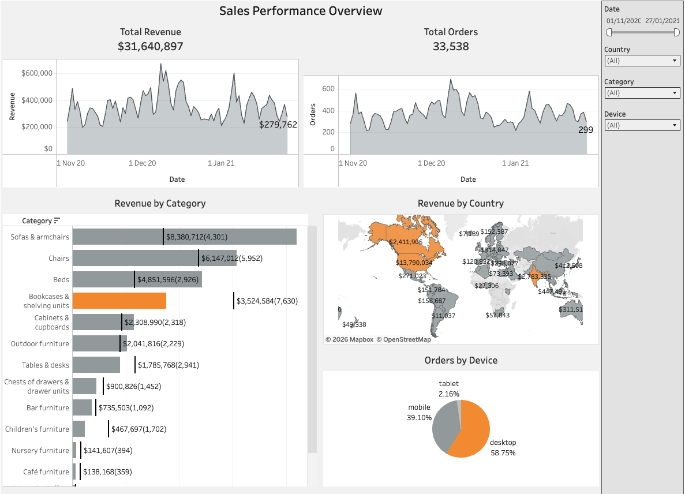

# Sales Performance Overview Dashboard
Tableau dashboard analyzing sales performance, revenue trends, and order activity across product categories, countries, and devices.

## Dashboard Preview

## Business Task
Analyze company sales performance using revenue and order data to identify trends across product categories, countries, and devices.

## Tools
Tableau, Data Visualization, Dashboard Design, KPI Analysis

## Key Insights
- Total revenue exceeds $31M with more than 33K orders.
- Sofas & armchairs and chairs generate the highest revenue.
- Desktop devices generate most orders, while mobile also contributes a large share.
- The Americas generate the highest sales among all regions.
- Revenue and orders show clear trends over time.

## Interactive Dashboard
[View the interactive dashboard on Tableau Public](https://public.tableau.com/views/SalesPerformanceOverview_17730058632790/Sales?:language=en-GB&:sid=&:redirect=auth&:display_count=n&:origin=viz_share_link)
